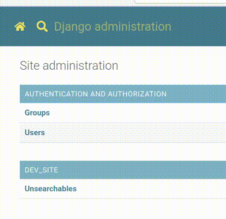

# django-admin-omni-search

> Django Admin Site extension, that allows searching all entities from single
> field



## Installation and usage

Go to the [pypi package README.md](./packages/pypi/README.md)

## Development

You will need Node.js, npm and Python to build this locally

```shell
npm ci
```

### Storybooks

To improve individual components, run the Storybooks

```shell
npm run storybook
```

### Local dev environment

There is a [dev-site](./packages/dev-site) prepared and configured, which canbe
used to develop against real environment. You will need poetry to install deps.

```
npm run dev-site
```

And there is the [search](./packages/search) package, which contains the React
UI project. You will need to run this in a separate terminal.

```
npm run dev-ui
```

Then open a browser and navigate to [http://localhost:8010](http://localhost:8010).
